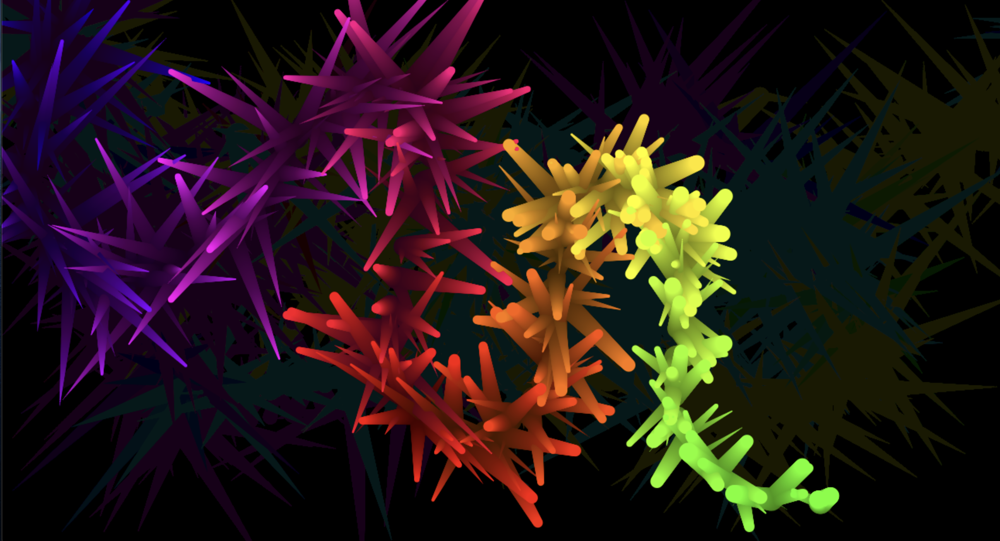

# ANIMATION - PARTICLE EFFECT

#### Deployed Link
https://ritahc.github.io/Particle-Animation/

## USER STORY
As the user moves the cursor pointer through the screen, a trail of colorful particles begin to apper. 
- `New Particles keeps appearing as the cursor moves`
- `Old particles tend to fade with new particles appearing on screen`

## Technologies Used
- HTML Canvas
- Java Script
- CSS

# Wire Frame

